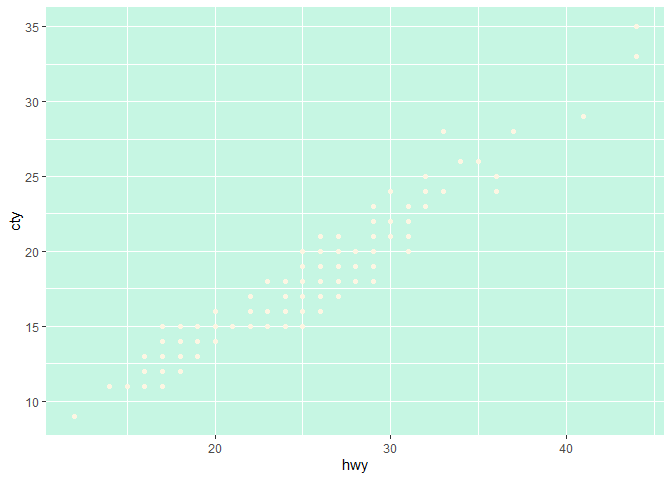
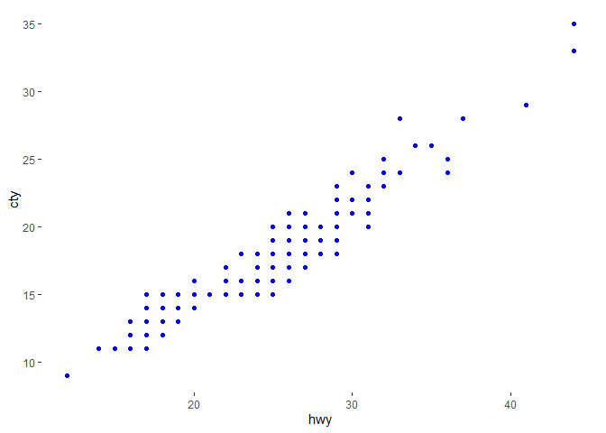

<!-- README.md is generated from README.Rmd. Please edit that file -->

# savonliquide

<!-- badges: start -->

[](https://cran.r-project.org/package=savonliquide)
[](https://cran.r-project.org/package=savonliquide)
[](https://cran.r-project.org/package=savonliquide)
[](https://cran.r-project.org/package=savonliquide)
[](https://choosealicense.com/licenses/mit/)
[](https://github.com/feddelegrand7/savonliquide)
[](https://github.com/feddelegrand7/savonliquide/actions)

<!-- badges: end -->

`savonliquide` is a package that contains a set of functions that helps
you deal with accessibility issues in R, RMarkdown and Shiny.

## Installation

You can install the stable version of `savonliquide` from
[CRAN](https://CRAN.R-project.org) with:

``` r
install.packages("savonliquide")
```

or you can install the development version from `Github` with:

``` r
remotes::install_github("feddelegrand7/savonliquide")
```

# 1. `check_contrast()` and `check_contrast_raw()`

`check_contrast()` allows you to generate a report from the [Contrast
Checker API](https://webaim.org/resources/contrastchecker/). The report
will display a contrast ratio among other useful information that will
judge the accessibility level of your color contrast.

## Examples

The following plot is awful in terms of color contrast. The two main
colors used are : `#FDF6E3` (for points) and `#C6F6E3"` for the
background.

``` r
library(ggplot2)
#> Warning: package 'ggplot2' was built under R version 4.0.3

ggplot(mpg, aes(hwy, cty)) +
  geom_point(color = "#FDF6E3") +
  theme(panel.background = element_rect(fill = "#C6F6E3"))
```



Let’s check the contrast:

``` r
library(savonliquide)
# fg_col stands for foreground color
# bg_col stands for background color


check_contrast(fg_col = "#FDF6E3",
               bg_col = "#C6F6E3")
#> 
#> * The Contrast Ratio is 1.10
#> 
#> * The result for the AA check is : FAIL
#> 
#> * The result for the AALarge check is : FAIL
#> 
#> * The result for the AAA check is : FAIL
#> 
#> * The result for the AAALarge check is : FAIL
```

You can see that the report indicates that we’ve a very low Contrast
Ratio and that we’ve failed all the recommended standards (In the web
development industry we consider mostly the AA standard).

Now let’s experiment other colors combinations. Let’s go for:

-   Foreground color: \#0000FF

-   Background color: \#FFFFFF

``` r
check_contrast(fg_col = "#0000FF",
               bg_col = "#FFFFFF")
#> 
#> * The Contrast Ratio is 8.59
#> 
#> * The result for the AA check is : PASS
#> 
#> * The result for the AALarge check is : PASS
#> 
#> * The result for the AAA check is : PASS
#> 
#> * The result for the AAALarge check is : PASS
```

Awesome ! we’ve got an excellent Contrast Ratio and we’ve passed all the
accessibility standards. Let’s use the above colors to render our plot
again:

``` r
ggplot(mpg, aes(hwy, cty)) +
  geom_point(color = "#0000FF") +
  theme(panel.background = element_rect(fill = "#FFFFFF"))
```



The `check_contrast_raw()` function allows you to get the same
information but in a raw format. To be more precise, you get a `list`
object.

``` r
check_contrast_raw(fg_col = "#0000FF", bg_col = "#FFFFFF")
#> $ratio
#> [1] "8.59"
#> 
#> $AA
#> [1] "pass"
#> 
#> $AALarge
#> [1] "pass"
#> 
#> $AAA
#> [1] "pass"
#> 
#> $AAALarge
#> [1] "pass"
```

``` r
paste0("This is a good Contrast Ratio ",
       check_contrast_raw(fg_col = "#0000FF", bg_col = "#FFFFFF")$ratio)
#> [1] "This is a good Contrast Ratio 8.59"
```

# 2. `add_description()`

The `add_description()` function works in RMarkdown documents (HTML
output) and Shiny application. It creates an HTML element that will be
used to describe another element. When a screen-reader user focuses on
the former, he will hear the vocal description provided by the latter.
Let’s dig into an example in Shiny. Note that in order to experiment the
following example, you must install and enable a screen reader of your
choice (I’m using the Chrome Vox Google Chrome extension).

``` r
library(savonliquide)
library(shiny)
library(magrittr)

ui <- fluidPage(

     h2("Using a screen reader
         hit Tab and Shift + Tab to
         navigate between the buttons
         and stop at button 2 to see the difference"),

     actionButton(
       inputId = "inp1",
       label = "button 1"
     ),
     actionButton(
       inputId = "inp2",
       label = "button 2"
     ) %>%
       add_description(
         description = "hello this is a button
                    when you click it you'll have a
                    thing, when you don't click it you'll
                    have another thing",
         descID = "descriptor" # the ID of the element that will be created and used as a descriptor
       )
   )

server <- function(input, output, session) {}

shinyApp(ui, server)
```

By default the description will be invisible for non screen-reader users
but you can set it to be visible by setting the parameter `visible` to
`TRUE`.

# 3. `describe_using()`

`describe_using()` relies on a **preexisting** HTML element to describe
another element. Note that you can use many elements to describe one.

``` r
library(savonliquide)
library(shiny)
library(magrittr)

ui <- fluidPage(

   h2("Using a screen reader
         hit Tab and Shift + Tab to
         navigate between the buttons
         and stop at button 2 to see the difference"),

   div(
      id = "paragraph1",
      p("The following paragraph tag will be used as the first descriptor")
   ),

   div(
      id = "paragraph2",
      p("The following paragraph tag will be used as the second descriptor")
   ),

   actionButton(
      inputId = "inp1",
      label = "button 1"
   ),
   actionButton(
      inputId = "inp2",
      label = "button 2"
   ) %>%
      describe_using(
         descID = c("paragraph1", "paragraph2")
      )
)

server <- function(input, output, session) {}

shinyApp(ui, server)
```

# 4. `create_invisible_anchor()`

This functions allows you to create an invisible HTML anchor tag that
will be heard only by screen-reader users. The anchor will be used to
redirect them to a particular web page that could be more adapted to
their condition.

``` r
library(savonliquide)
library(shiny)
library(magrittr)

ui <- fluidPage(

   h2("Using a screen reader
         hit <Tab> or <Shift + Tab> to
         navigate until you discover the invisible anchor tag"),

   actionButton(
      inputId = "inp1",
      label = "button 1"
   ),
   actionButton(
      inputId = "inp2",
      label = "button 2"
   ),

   create_invisible_anchor(
      id = "invisible-anchor",
      text = "Hit ENTER if you want to be redirected to google.com",
      href = "https://google.com"
   )
)

server <- function(input, output, session) {}

shinyApp(ui, server)
```

# 5. `make_skiplinks()`

Often, in heavy website or application, you might want a screen-reader
user to have the choice to skip superfluous HTML elements and go
directly to the main-content. In such situation, you might consider
skiplinks! just try out with the following example:

``` r
library(savonliquide)
library(shiny)
library(magrittr)

ui <- fluidPage(

   h2("Using a screen reader
       hit <Tab> or <Shift + Tab> to
       navigate until you get asked 
       if you want to skip to the main content"),

   a("do you want to be redirected to the main content ?",
          id = "skiplink") %>%
      make_skiplinks(
         skip_to = "#main-content", # note that we need to append '#' to the ID
         bg_color = "red",
         col = "white"
      ),

   actionButton(
      inputId = "inp1",
      label = "button 1"
   ),
   actionButton(
      inputId = "inp2",
      label = "button 2"
   ),

   div(
      id = "main-content",
      h1("The main content starts here")
   )

)

server <- function(input, output, session) {}

shinyApp(ui, server)
```

# 6. `make_tabbable()`

Some HTML elements (for example `buttons` or `anchors`) get focusable by
default when you hit <Tab> or &lt;SHIFT+Tab&gt; to navigate within a web
page/app, you can say that these elements are **tabbable**, in other
words the screen-reader focuses on theses elements when you hit tab.
When developing a website/app you might consider enabling this feature
for elements that are not tabbable by default (for example paragraph and
titles) or desabling this feature for elements that are tabbable by
default. Consider the following example:

``` r
library(savonliquide)
library(shiny)
library(magrittr)

ui <- fluidPage(

   h2("Using a screen reader
       hit <Tab> or <Shift + Tab> to
       navigate and see which element is tabbable or not"),

   actionButton(
      inputId = "inp1",
      label = "button 1"
   ),

   p("This is the first paragraph"),


   actionButton(
      inputId = "inp2",
      label = "button 2"
   ),
   
   p("This is the second paragraph")

)

server <- function(input, output, session) {}

shinyApp(ui, server)
```

When you navigate the application, you can see that only the buttons get
focusable when you hit the <Tab> key. We can change this behavior, let’s
make the title and the two paragraphs tabbable and the buttons
untabbable and observe the difference.

``` r
library(savonliquide)
library(shiny)
library(magrittr)

ui <- fluidPage(

   h2("Using a screen reader
       hit <Tab> or <Shift + Tab> to
       navigate and see which element is tabbable or not") %>%
      make_tabable(tab_index = 0),

   actionButton(
      inputId = "inp1",
      label = "button 1"
   ) %>%
      make_tabable(tab_index = -1) # a negative value will make it untabbable
   ,

   p("This is the first paragraph") %>%
      make_tabable(tab_index = 0),


   actionButton(
      inputId = "inp2",
      label = "button 2"
   ) %>%
      make_tabable(tab_index = -1),

   p("This is the second paragraph") %>%
      make_tabable(tab_index = 0)

)

server <- function(input, output, session) {}

shinyApp(ui, server)
```

## Code of Conduct

Please note that the savonliquide project is released with a
[Contributor Code of
Conduct](https://contributor-covenant.org/version/2/0/CODE_OF_CONDUCT.html).
By contributing to this project, you agree to abide by its terms.
