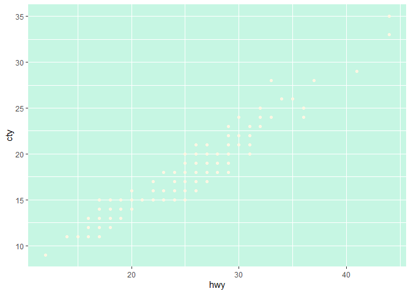
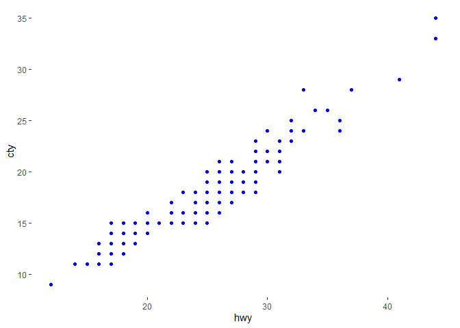

<!-- README.md is generated from README.Rmd. Please edit that file -->

# savonliquide

<!-- badges: start -->
[](https://cran.r-project.org/package=savonliquide)
[](https://cran.r-project.org/package=savonliquide)
[](https://cran.r-project.org/package=savonliquide)
[](https://cran.r-project.org/package=savonliquide)
[](https://choosealicense.com/licenses/mit/)
[](https://github.com/feddelegrand7/savonliquide)
<!-- badges: end -->

`savonliquide` is a tiny package that allows you to generate a report
from the [Contrast Checker
API](https://webaim.org/resources/contrastchecker/). The report will
display a contrast ratio among other useful information that will judge
the accessibility level of your color contrast. `savonliquide` can be
used to evaluate color contrast accessibility for plots, RMarkdown
documents, Shiny Apps and even for the RStudio IDE theme (for teaching
situations).

## Installation

You can install the released version of `savonliquide` from
[CRAN](https://CRAN.R-project.org) with:

``` r
remotes::install_github("feddelegrand7/savonliquide")
```

## Example

The following plot is awful in terms of color contrast. The two main
colors used are : `#FDF6E3` (for points) and `#C6F6E3"` for the
background.

``` r
library(ggplot2)

ggplot(mpg, aes(hwy, cty)) +
  geom_point(color = "#FDF6E3") +
  theme(panel.background = element_rect(fill = "#C6F6E3"))
```



Let’s check the contrast:

``` r
library(savonliquide)
# fg_col stands for foreground color 
# bg_col stands for background color


check_contrast(fg_col = "#FDF6E3", 
               bg_col = "#C6F6E3")
#> 
#> * The Contrast Ratio is 1.10
#> 
#> * The result for the AA check is : FAIL
#> 
#> * The result for the AALarge check is : FAIL
#> 
#> * The result for the AAA check is : FAIL
#> 
#> * The result for the AAALarge check is : FAIL
```

You can see that the report indicates that we’ve a very low Contrast
Ratio and that we’ve failed all the recommended standards (In the web
development industry we consider mostly the AA standard).

Now let’s experiment other colors combinations. Let’s go for:

-   Foreground color: \#0000FF

-   Background color: \#FFFFFF

``` r
check_contrast(fg_col = "#0000FF", 
               bg_col = "#FFFFFF")
#> 
#> * The Contrast Ratio is 8.59
#> 
#> * The result for the AA check is : PASS
#> 
#> * The result for the AALarge check is : PASS
#> 
#> * The result for the AAA check is : PASS
#> 
#> * The result for the AAALarge check is : PASS
```

Awesome ! we’ve got an excellent Contrast Ratio and we’ve passed all the
accessibility standards. Let’s use the above colors to render our plot
again:

``` r
ggplot(mpg, aes(hwy, cty)) +
  geom_point(color = "#0000FF") +
  theme(panel.background = element_rect(fill = "#FFFFFF"))
```



### check\_contrast\_raw()

The `check_contrast_raw()` function allows you to get the same
information but in a raw format. To be more precise, you get a `list`
object.

``` r
check_contrast_raw(fg_col = "#0000FF", bg_col = "#FFFFFF")
#> $ratio
#> [1] "8.59"
#> 
#> $AA
#> [1] "pass"
#> 
#> $AALarge
#> [1] "pass"
#> 
#> $AAA
#> [1] "pass"
#> 
#> $AAALarge
#> [1] "pass"
```

``` r
paste0("This is a good Contrast Ratio ", 
       check_contrast_raw(fg_col = "#0000FF", bg_col = "#FFFFFF")$ratio)
#> [1] "This is a good Contrast Ratio 8.59"
```

## Code of Conduct

Please note that the savonliquide project is released with a
[Contributor Code of
Conduct](https://contributor-covenant.org/version/2/0/CODE_OF_CONDUCT.html).
By contributing to this project, you agree to abide by its terms.
